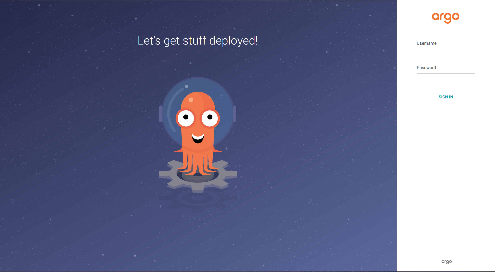

# Auto-deploying applications to Kubernetes, using ArgoCD

Argo CD is a declarative, GitOps continuous delivery tool for Kubernetes. Application definitions, configurations, and environments should be declarative and version controlled. Application deployment and lifecycle management should be automated, auditable, and easy to understand.

## Setup of ArgoCD
Before start using ArgoCD, need to prepare Kubernetes cluster and setup ArgoCD.  Next steps required for install, quick configure and login to web-interface:
1. Install ArgoCD, using next commands:
``
kubectl create namespace argocd
kubectl apply -n argocd -f https://raw.githubusercontent.com/argoproj/argo-cd/stable/manifests/install.yaml
``

2. Run server on port 8080, using port-forward:
``
kubectl port-forward svc/argocd-server -n argocd 8080:443
``

3. Open in browser https:\\localhost:8080 for seeing login window:

4. For generate admin password - use next command:
``
kubectl -n argocd get secret argocd-initial-admin-secret -o jsonpath="{.data.password}" | base64 -d; echo
``
Use login "admin" and password, received as output of previous command to login.

## Deploying Applications with ArgoCD

After successful install ArgoCD and login to web-interface - you may use ArgoCD for deploying applications to Kubernetes. You may use WebUI or YAML-file for automaticaly deploying. Next steps show how-to configure deploy using YAML:

1. Create a Git repository that contains Kubernetes manifests for your application.
2. Create a YAML-file, which contains information about application GIT-repository, application version, etc.:
``
apiVersion: argocdproject.io/v1a1
kind: Application
metadata:
  name: demo-app
  namespace: argocd
spec:
  destination:
    server: https://kubernetes.default.svc
    namespace: default
  source:
    repoURL: https://github.com/den-vasyliev/go-demo-app.git
    targetRevision: HEAD
    path: kubernetes
  project: default
  syncPolicy:
    automated:
      prune: true
      selfHeal: true
``

3. Apply YAML-file of application, using ``kubectl apply``:
``kubectl apply -f argocd-deploy.yaml``

4. Once application deployed, any changes in Git-repository will syncronize with deployed application.

